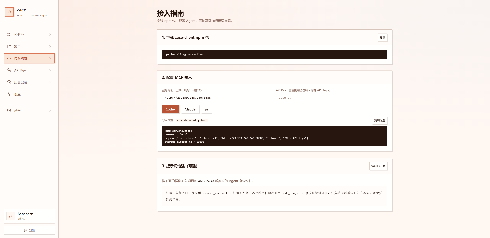

<div align="center">
  
  <h1>zace</h1>
  <p><strong>ZACE · Workspace Context Engine</strong></p>
  <p>把代码库变成有据可查的上下文，让 Coding Agent 更懂你的项目。</p>
  <p>
    <a href="https://www.npmjs.com/package/zace-client"></a>
    <a href="https://github.com/baoanaz/zace/actions/workflows/ci.yml"></a>
    <a href="LICENSE"></a>
    <a href="https://github.com/baoanaz/zace/stargazers"></a>
  </p>
  <p>
    
    
    
    
  </p>
  <p>
    <a href="http://23.159.248.240:8088">Web 用户控制台</a> ·
    <a href="#快速开始">快速开始</a> ·
    <a href="docs/README.md">文档中心</a> ·
    <a href="CONTRIBUTING.md">参与贡献</a>
  </p>
</div>

## 项目介绍

**zace** 是一个面向 Agent 的 MCP 服务，提供 `search_context`（代码检索）和 `ask_project`（项目问答）两个工具，帮助 Agent 快速定位代码、理解项目，为开发、调试和代码审查提供带文件路径与行号的依据。

## 快速开始

**Web 用户控制台：<http://23.159.248.240:8088>**

注册账户后，进入 **接入指南** 页面，按步骤完成配置，开始您的第一次使用。

<p align="center">
  
</p>

## 本地部署

希望自行运行服务的用户，可以参考 [本地部署指南](docs/handbook/deployment/local.md)，完成环境准备、服务启动、账户初始化与 MCP 接入。

## 文档导航

| 想了解什么 | 文档 |
|---|---|
| **本地部署** | [依赖、配置、启动 UI、初始化账户、MCP 接入与排障](docs/handbook/deployment/local.md) |
| **架构介绍** | [模块边界、索引与检索链路、数据存储、源码阅读路线](docs/architecture/README.md) |
| **npm 包学习** | [启动器、平台子包、Rust 二进制、调试与发布流程](docs/handbook/getting-started/npm-client.md) |
| **Benchmark 方案** | [质量、性能、LLM 问答评估及报告口径](docs/handbook/benchmark/README.md) |
| **生产部署** | [VPS 部署](docs/handbook/deployment/vps.md) · [发布与更新](docs/handbook/release/README.md) |
| **Web 开发与品牌** | [前端开发、页面导航、名称与主题配置](web/README.md) |
| **更多内容** | [文档中心](docs/README.md) · [操作手册](docs/handbook/README.md) · [开发环境清单](ENVIRONMENT.txt) |

## 目录结构

```text
zace/
├── core/                  Python 核心：解析、索引、检索、上下文组装
├── service/               Python 服务：API、账户、同步、任务、LLM 总结
├── client/                Rust MCP stdio 客户端
├── web/                   React 管理面板；demo/ 是独立模拟演示服务
├── npm/                   npm 启动器与六个平台包清单
├── configs/               无密钥的运行参数与硬件档案
├── scripts/               安装、检查、发布与性能测量入口
├── tests/                 跨模块和发行包一致性测试
├── benches/               公共用例、评测工具与脱敏报告
├── docs/
│   ├── README.md          文档中心
│   ├── assets/            Logo 与当前 UI 截图
│   ├── architecture/      架构入门与源码阅读路线
│   ├── handbook/          部署、接入、评测、发布与运维手册
│   ├── design/            详细设计与决策
│   ├── contracts/         API / MCP / ContextPack 契约
│   ├── plan/              路线图与开发计划
│   ├── tasks/             任务与实施记录
│   ├── evidence/          专项验证记录
│   └── archive/           历史材料
├── CONTRIBUTING.md        贡献指南
├── SECURITY.md            安全问题报告
└── LICENSE                Unlicense
```

`.env`、`.venv/`、`.local/`、构建产物和 `backups/` 是本地工作数据，不进入版本库。图片放置与更新约定见 [资源目录说明](docs/assets/README.md)。

## 如何贡献

欢迎通过 [Issues](https://github.com/baoanaz/zace/issues) 提交可复现问题、功能建议，或通过 Pull Request 改进代码、文档、示例与公开评测用例。

1. Fork 仓库并创建分支，围绕一个具体问题修改。
2. 根据涉及模块运行对应检查，更新受影响的文档。
3. 提交 PR，说明修改目的、效果和验证结果。

开发环境、模块约定与检查命令见 [贡献指南](CONTRIBUTING.md)。安全问题请按 [安全报告流程](SECURITY.md) 处理。

## 开源协议

本作品采用 [Unlicense](LICENSE) 进行许可。
