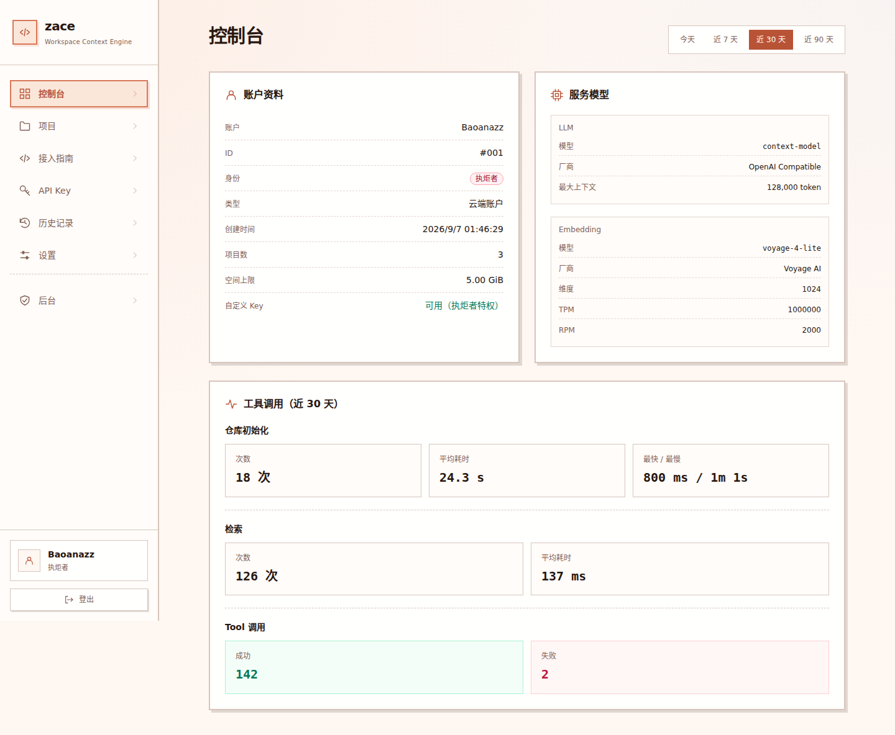

<div align="center">
  
  <h1>zace</h1>
  <p><strong>ZACE · Workspace Context Engine</strong></p>
  <p>把代码库变成有据可查的上下文，让 Coding Agent 更懂你的项目。</p>
  <p>
    <a href="https://www.npmjs.com/package/zace-client"></a>
    <a href="https://github.com/baoanaz/zace/actions/workflows/ci.yml"></a>
    <a href="LICENSE"></a>
    <a href="https://github.com/baoanaz/zace/stargazers"></a>
  </p>
  <p>
    
    
    
    
  </p>
  <p>
    <a href="http://23.159.248.240:8088">在线 UI 演示</a> ·
    <a href="#快速开始">快速开始</a> ·
    <a href="docs/README.md">文档中心</a> ·
    <a href="CONTRIBUTING.md">参与贡献</a>
  </p>
</div>

## 项目介绍

**zace**（简称 **ZACE**）是面向 Coding Agent 的代码库上下文引擎。它把仓库中的代码与文档解析成可检索的片段，结合符号关系、全文和向量检索，为开发、调试、代码审查提供带文件位置的依据。

你可以把它接入 Codex、Claude Code、Cursor 等支持 MCP 的工具：客户端同步本地仓库，服务端维护索引，Agent 按需获取相关实现与跨文件解释。

| 能力 | 可以做什么 |
|---|---|
| **代码与文档检索** | 当前解析器支持 Python、C/C++、Markdown，保留路径、行号和符号信息 |
| **混合检索** | 结合全文、向量、符号与图扩展，按上下文预算组织证据 |
| **增量同步** | 本地客户端扫描仓库，将变化同步到服务端，减少重复上传和索引 |
| **带引用的问答** | 在检索证据上调用可配置的 LLM，检查引用，明确说明证据不足或未配置的情况 |
| **Web 管理面板** | 查看项目、API Key、调用历史和服务模型；自定义个人 LLM 总结配置 |
| **可复现评测** | 提供公共 golden 用例、质量回归入口和索引性能探针 |

对 Agent 暴露两个 MCP 工具：

| 工具 | 用途 |
|---|---|
| `search_context` | 找到相关实现并返回上下文；不调用总结 LLM，向量检索仍可能调用 embedding 服务 |
| `ask_project` | 在检索证据上生成带引用的回答；LLM 未配置或证据不足时明确降级 |

## 快速开始

### 1. 先看 UI

**在线演示：<http://23.159.248.240:8088>**

使用维护者提供的演示账号登录。这里展示模拟项目、指标和历史记录，适合查看界面与交互；保存、注册、索引和模型调用不执行。**演示网址不提供真实 MCP 服务**，接入 Agent 时请使用自行部署或管理员提供的服务地址。

<p align="center">
  
</p>

### 2. 连接已有服务

需要 Node.js 18+，并从实际服务的 **API Key** 页面创建访问凭据。

```bash
npm install -g zace-client@latest
zace-client --help
```

在 Codex 的 `~/.codex/config.toml` 中添加配置，将地址和 Key 换成自己的：

```toml
[mcp_servers.zace]
command = "zace-client"
args = ["--base-url", "http://127.0.0.1:8787", "--token", "<你的 API Key>"]
startup_timeout_ms = 60000
```

重启 Agent 后确认能看到 `search_context` 和 `ask_project`。首次调用会同步代码并建立索引，大仓库需要等待。Claude Code、Cursor、pi 的配置见 [npm 客户端说明](npm/README.md)。

### 3. 在本地部署

需要 Python 3.12+、[uv](https://docs.astral.sh/uv/)、Node.js 22 和 npm。Linux / WSL 的完整步骤见 [本地部署指南](docs/handbook/deployment/local.md)。

```bash
git clone https://github.com/baoanaz/zace.git
cd zace
bash scripts/setup-dev.sh --with-web
set -a
source .env
set +a
uv run zace-service serve --host 127.0.0.1 --port 8787
```

另开一个终端，在仓库根目录启动 UI：

```bash
npm --prefix web run dev -- --host 127.0.0.1 --strictPort
```

打开 **<http://127.0.0.1:5173>**，按页面提示初始化首个账户。API 服务位于 `http://127.0.0.1:8787`。真实索引前，在安装脚本创建的 `$HOME/.key/zace/secrets.env` 中填写 embedding 凭据，再加载 `.env` 并重启后端；总结 LLM 可在设置页自定义。

## 文档导航

| 想了解什么 | 文档 |
|---|---|
| **本地部署** | [依赖、配置、启动 UI、初始化账户、MCP 接入与排障](docs/handbook/deployment/local.md) |
| **架构介绍** | [模块边界、索引与检索链路、数据存储、源码阅读路线](docs/architecture/README.md) |
| **npm 包学习** | [启动器、平台子包、Rust 二进制、调试与发布流程](docs/handbook/getting-started/npm-client.md) |
| **Benchmark 方案** | [质量、性能、LLM 问答评估及报告口径](docs/handbook/benchmark/README.md) |
| **生产部署** | [VPS 部署](docs/handbook/deployment/vps.md) · [发布与更新](docs/handbook/release/README.md) |
| **Web 开发与品牌** | [前端开发、页面导航、名称与主题配置](web/README.md) |
| **更多内容** | [文档中心](docs/README.md) · [操作手册](docs/handbook/README.md) · [开发环境清单](ENVIRONMENT.txt) |

## 目录结构

```text
zace/
├── core/                  Python 核心：解析、索引、检索、上下文组装
├── service/               Python 服务：API、账户、同步、任务、LLM 总结
├── client/                Rust MCP stdio 客户端
├── web/                   React 管理面板；demo/ 是独立模拟演示服务
├── npm/                   npm 启动器与六个平台包清单
├── configs/               无密钥的运行参数与硬件档案
├── scripts/               安装、检查、发布与性能测量入口
├── tests/                 跨模块和发行包一致性测试
├── benches/               公共用例、评测工具与脱敏报告
├── docs/
│   ├── README.md          文档中心
│   ├── assets/            Logo 与当前 UI 截图
│   ├── architecture/      架构入门与源码阅读路线
│   ├── handbook/          部署、接入、评测、发布与运维手册
│   ├── design/            详细设计与决策
│   ├── contracts/         API / MCP / ContextPack 契约
│   ├── plan/              路线图与开发计划
│   ├── tasks/             任务与实施记录
│   ├── evidence/          专项验证记录
│   └── archive/           历史材料
├── CONTRIBUTING.md        贡献指南
├── SECURITY.md            安全问题报告
└── LICENSE                Unlicense
```

`.env`、`.venv/`、`.local/`、构建产物和 `backups/` 是本地工作数据，不进入版本库。图片放置与更新约定见 [资源目录说明](docs/assets/README.md)。

## 如何贡献

欢迎通过 [Issues](https://github.com/baoanaz/zace/issues) 提交可复现问题、功能建议，或通过 Pull Request 改进代码、文档、示例与公开评测用例。

1. Fork 仓库并创建分支，围绕一个具体问题修改。
2. 根据涉及模块运行对应检查，更新受影响的文档。
3. 提交 PR，说明修改目的、效果和验证结果。

开发环境、模块约定与检查命令见 [贡献指南](CONTRIBUTING.md)。安全问题请按 [安全报告流程](SECURITY.md) 处理。

## 开源协议

本项目采用 **[Unlicense](LICENSE)**：可以自由使用、复制、修改、商用、分发和闭源集成，不要求署名或公开衍生作品源码。

第三方依赖、外部评测仓库及其内容保留各自的许可证。历史 npm 发布包以随包许可证为准。
