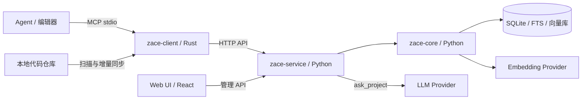

# 架构介绍

[文档中心](../README.md) · [本地部署](../handbook/deployment/local.md)

zace 的主要链路是：Agent 通过本地 MCP 客户端提出问题，客户端同步仓库变化，服务端调用核心引擎检索，再把带位置的证据或带引用的回答交给 Agent。

## 1. 模块边界

| 模块 | 负责 | 入口 |
|---|---|---|
| `core` | 解析、切片、索引、混合检索、证据扩展、上下文组装 | [engine.py](../../core/zace_core/engine.py) |
| `service` | HTTP/MCP、账户与归属校验、同步、索引任务、审计、LLM 总结 | [app.py](../../service/zace_service/app.py) |
| `client` | 本地仓库扫描、变化同步、MCP stdio 与远端请求桥接 | [main.rs](../../client/src/main.rs) |
| `web` | 账户、项目、Key、历史、模型配置和管理界面 | [App.tsx](../../web/src/app/App.tsx) |
| `npm` | 选择当前平台的 Rust 二进制并启动 | [run.js](../../npm/run.js) |

服务端内部依赖方向是 **service → core**。Web 与 Rust 客户端通过接口调用 service。core 不依赖上层的 Web 框架、账户或租户实现；依赖方向由仓库检查脚本约束。

## 2. 一次索引发生了什么

1. **识别仓库和变化**：客户端在本地扫描，按照忽略规则筛选文件，对比内容并同步变更。
2. **接收与调度**：service 校验请求身份和项目归属，接收同步数据、安排索引任务并记录进度。
3. **解析与切片**：core 使用对应语言解析器，提取代码块、符号、位置和关系。当前解析器覆盖 Python、C/C++ 和 Markdown。
4. **建立索引**：结构信息与全文索引进入 SQLite/FTS，embedding 向量进入向量存储；已有内容可以利用缓存减少重复计算。
5. **保存状态**：记录索引结果、错误和耗时，供后续查询及 UI 历史展示。

首次同步可能需要处理整个仓库，后续调用以变化为基础推进。切换 embedding 模型或维度时，需要按配置迁移流程处理，不能假定旧向量仍可直接复用。

## 3. `search_context` 检索链路

检索不仅返回相似文本，还会结合符号、关系与文档信息，组织成 Agent 可以继续阅读的上下文。组装阶段受 token 预算约束，尽量保留有效位置与证据关系。

`search_context` 不调用总结 LLM。若选择 API embedding，查询向量的生成仍可能产生外部 API 请求，因此“没有总结调用”不等于“完全离线”。

核心装配入口是 [engine.py](../../core/zace_core/engine.py)，上下文结构见 [ContextPack schema](../contracts/contextpack.schema.json)。质量对比应使用固定模型、预算和输入的 [benchmark 方案](../handbook/benchmark/README.md)。

## 4. `ask_project` 与 LLM

`ask_project` 在同一套检索证据之上增加总结过程，由 service 负责读取有效 LLM 配置、调用 provider，并检查回答引用。

- **用户配置**：设置页可以保存当前账户的模型、接口地址和 Key。
- **服务配置**：没有个人配置时，使用部署环境中的 `ANSWER_*` 配置。
- **证据不足**：明确返回不足信息，避免把没有依据的回答当作已验证结论。
- **未配置模型**：返回降级结果，不把空值当作配置成功。
- **引用检查**：检查引用是否对应提供的证据；这不等同于完整的语义正确性评估。

MCP 工具的具体输入输出见 [工具契约](../contracts/mcp-tools.json)，HTTP 端点见 [OpenAPI](../contracts/openapi.yaml)。

## 5. 数据与运行形态

| 数据 | 位置或归属 |
|---|---|
| 服务运行数据 | `ZACE_DATA_ROOT`；使用仓库模板时为 `.local/data/` |
| 项目索引 | 数据根下的 `projects/`，由核心引擎管理 |
| 账户、会话、API Key 元信息 | service 的元数据库 |
| 客户端同步缓存 | 默认 `~/.cache/zace`，可用 `--cache-root` 修改 |
| 开发凭据 | 仓库外的 `$HOME/.key/zace/secrets.env` |
| 基准原始产物 | 默认 `.local/bench/`；审查后的公开报告放 `benches/results/` |

`serve` 运行完整账户服务，由客户端上传仓库；`local --repo` 直接读取本机目录并使用隐式本地账户。`web/demo/` 则提供完全独立的合成数据 API，仅展示 UI。

API embedding 会向配置的服务发送相应文本，LLM 总结会发送检索证据。索引中的代码正文同样是源码副本，备份和分享时应按源码对待。

## 6. 建议的源码阅读顺序

| 顺序 | 文件 | 重点 |
|---|---|---|
| 1 | [client/src/main.rs](../../client/src/main.rs) | 客户端参数、环境变量、运行入口 |
| 2 | [npm/run.js](../../npm/run.js) | npm 如何找到和启动上述客户端 |
| 3 | [service 启动入口](../../service/zace_service/__main__.py) | `serve`、`local` 与数据根 |
| 4 | [service/app.py](../../service/zace_service/app.py) | 应用装配、路由和运行时依赖 |
| 5 | [core/engine.py](../../core/zace_core/engine.py) | 索引、召回、扩展、排序与组装的连接点 |
| 6 | [web/App.tsx](../../web/src/app/App.tsx) | 账户门禁、页面与 API 的关系 |

进一步研究具体设计时，从 [设计索引](../design/INDEX.md) 进入各模块文档；准备改接口时先看 [契约变更流程](../contracts/PROCESS.md)。历史设计包含阶段性决策，当前行为应以实现和现行手册为准。
