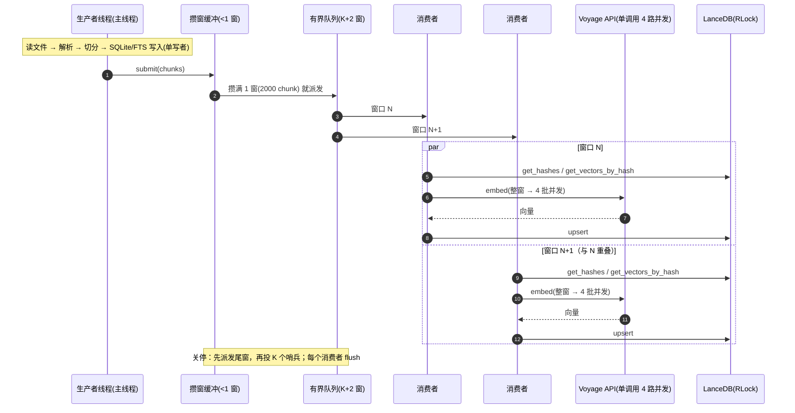

# TASK-115：向量阶段多窗口并行（消费者拆分）

> 状态：review ｜ 阶段：Phase 5+（性能） ｜ 硬依赖：TASK-114 ✅（已合并） ｜ soft 依赖：无
> 建议分支：`feature/task-115_embed-parallel0926`
> 交付物所有权：`core/zace_core/pipeline/{embedding_sink,indexer}.py`、`core/tests/pipeline/**`、
> `benches/embed-bench/coldstart_probe.py`（打桩点）、`benches/results/{README.md,index-perf-task115-vps.md}`、
> `docs/tasks/{README.md,archive/TASK-114-*}`（仅在需要时）。清单外文件不得改。
> 输入：`benches/results/index-perf-task114-vps.md`（TASK-114 实测账目）。

## 目标

TASK-114 之后，langchain 冷启动 77.6s 里**消费者线程一户占 48.1s**：`取回 31.7s → 解码 4.8s →
落库 5.5s → 复用查询/缓存 ~4s` 在**同一个线程里顺序执行**，链路在解码/落库期间空转
（有效吞吐 7.2MB/s vs 链路上限 ~11MB/s；`network_busy_s / wall_s = 0.41`）。

本卡把消费者从 1 个拆成 **K 个（默认 2）**：窗口级并行，让"取回"与"解码/落库"在不同窗口之间重叠，
链路持续有 `K × concurrency` 路请求在飞。**不改 provider（CF-09 契约）、不改 FTS/检索、
不改 SQLite 单写者不变量。**

## 设计要点

1. **K 个 `EmbeddingSink` 实例**（各自的缓冲与计数），由一个 `EmbeddingPipeline` 管理；
   队列单位仍是"窗口"，有界 `K + 2` 个 → 背压即内存护栏（峰值 ≈ K × 窗口 × 33KB）。
2. **worker 数**：`ZACE_EMBED_WORKERS`（默认 2，夹在 1..4）；`1` 即退回 TASK-114 行为。
3. **失败语义不变**：任一 worker 失败 → 记录首个异常并继续排水（不让生产者死锁）→
   `submit` 尽早重抛、`close` 兜底重抛；`abort` 丢弃缓冲。
4. **去重口径**：窗口内按 embedding 文本去重（不变）；跨窗口仍靠向量表/缓存"写好即可见"。
   并行下"两个窗口同时判定同一 hash 未命中"会多嵌少量同内容 chunk——**实测记录差值**，
   不为它引入 claim/等待协议（收益 <1–4%，复杂度与死锁面不划算）。
5. **计数**：每个 sink 各记 `upserted / embedded / deduped / skipped`，pipeline 在关闭后求和；
   不变量 `upserted == embedded + deduped` 保持。

### 时序（改造后，K=2）

> 关键：**窗口必须整窗派发**。若按 K 把窗口切小，单次 `embed()` 的批数变少、链路并发反而上不去
> （实测 K=2 + 切窗 73.98s vs K=1 74.73s，等于没并行）。

## 验收标准（DoD）

- [ ] 新增测试：K 个消费者下计数不变量、窗口上限不变、失败回抛、abort 不 flush、关闭后无残留向量、
      背压不死锁（生产者被限流但最终完成）。
- [ ] `uv run pytest -o addopts="" -q` 全绿（含既有 indexer/sink 用例的期望更新）。
- [ ] 性能：langchain local-only（免费）**49.1s → ≤38s**；`network_busy_s / wall_s` 从 0.41 提升到 **≥0.7**；
      真实 API 跑一次 langchain 或 HelloAgents 对照（记录 token 与墙钟）。
- [ ] 峰值 RSS 增幅 ≤ +120MB（K=2）。
- [ ] 基线三条全绿；任务卡"执行记录"回填；任务板状态改 `review`。

## 明确不做

- 不做 provider 内部改造（async/流式取回）；不做多进程（P2-6，2 核收益不确定）；
- 不动冻结契约、不动检索/装填/rerank；不做质量参数调整；
- 不为并行去重引入阻塞式 claim/wait 协议。

## 执行记录

### 2026-09-26 ｜ 分支 `feature/task-115_embed-parallel0926` ｜ 工作区 `/root/xuwenzheng/ace/zace-par`

**关键决策**

1. **窗口在 pipeline 层全局攒满再派发**（不是每个消费者各自攒窗）。第一版按 `窗口 ÷ K` 给每个消费者
   切窗，实测**零收益**（K=2 73.98s vs K=1 74.73s）：provider 的并发是单次 `embed()` 调用内的
   （`batch_size=500 × concurrency=4`），窗口切半后单调用只剩 2 批 → 两个消费者加起来仍是 4 路在飞。
   改成"整窗派发"后 K=2 拿到 -20%。负结果与解释留在报告 §2。
2. **`ZACE_EMBED_WORKERS` 默认 2**（夹 1..4，设 1 退回 TASK-114 行为）；2 核上 K=3/4 未见额外收益
   （local-only K=3 反而慢 0.8s），默认保持 2。
3. **窗口大小不变**（`批大小 × 并发`），因此 `provider.calls == ceil(total/窗口)` 与 K=1 相同；
   代价是峰值向量 ≈ `K × 窗口 × 33KB`（实测 langchain +75MB）。
4. 并发下的去重仍靠"向量表写好即可见"+ 窗口内按 embedding 文本去重；**没有**引入 claim/wait 协议
   （两个窗口同时判定同一内容未命中时会多嵌极少量重复内容，实测 langchain 请求数 57→58）。

**验收命令与结果**

| 命令 | 结果 |
|---|---|
| `uv run ruff check .` | All checks passed |
| `uv run python scripts/check_dependency_direction.py` | 依赖方向检查通过 |
| `uv run pytest core/tests -q` | 771 passed, 9 skipped |
| `uv run pytest service/tests -q` | 552 passed |
| `uv run pytest tests -q` | 17 passed |
| langchain 真实 API（同会话 A/B，各 3.56M token） | **79.49s → 63.33s（-20%）**；网络在飞 37.7→29.7s、有效吞吐 6.03→7.69MB/s、峰值 748→823MB |
| HelloAgents 真实 API | 17.21s → **15.98s（-7%）**，峰值 502→542MB |
| langchain local-only（K=1/2/3） | 44.6 / 45.5 / — s（CPU 绑定，符合"收益来自 I/O 重叠"的判断） |

> 说明：本机 1.9GB 内存 + swap 吃紧，整包 `pytest` 单进程跑会被全局 OOM 杀（`exit=137`，`dmesg` 已确认
> 是 `warp-svc` 触发的全局 OOM，非本轮引入）；因此按 `core/tests` / `service/tests` / `tests` 分三段跑，
> 合计 **1340 passed, 9 skipped**（较 TASK-114 的 1334 多 6 条新用例）。

**与设计的偏差 / 未决问题**

1. 报告 §4 的外推（新机 ~22–28s）依赖"单核 ~2×、200Mbps"两个待实测前提——上机后请用探针量
   `network_busy_s / wall_s` 与 `peak_rss_mb`；
2. 下一个可调旋钮是 `EMBED_CONCURRENCY=8`（窗口 4000 → 峰值向量 ≈ K×132MB），本轮未实测
   （每次 3.56M token），留给新机按内存试；
3. 更深一层要把"取回"与"解码/落库"在**同一消费者内部**再拆开（需要动 provider 内部），
   本卡明确不做（见"明确不做"）。
